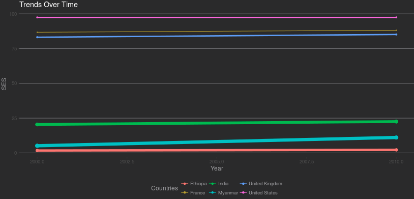
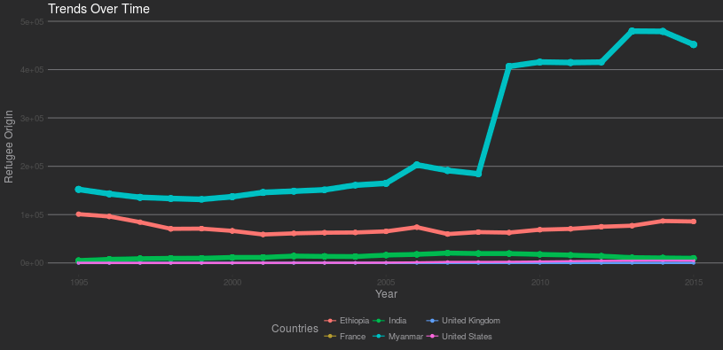
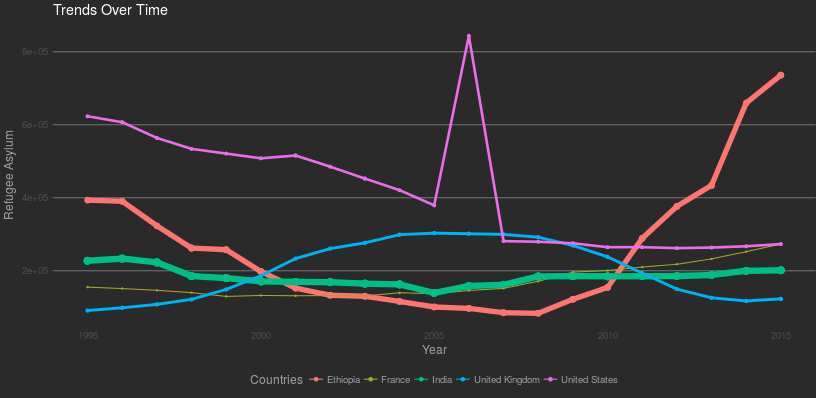

```{r setup, include=FALSE}
knitr::opts_chunk$set(echo = TRUE, message=FALSE, warning=FALSE, cache=TRUE, 
                      fig.width=7, fig.height=6, fig.align = "center")
options(digits=3)
```

```{r include=FALSE}
require(dplyr)
require(WDI)
require(plyr)
```

# Introduction

Since the end of the cold war in 1991, 2016 has been the fifth most violent year in the world [@trends]. Currently in 2017, there are more than 40 active conflicts in the world. Armed conflicts severely affect the lives of individuals in those countries. Most of the data online outlines the armed conflict and casualties of the many occurring wars. Others also include an [interactive feature](https://www.irinnews.org/maps-and-graphics/2017/04/04/updated-mapped-world-war) of the global conflict to observe the scale of the conflict with respect to other nations. One [special interactive map](https://www.cfr.org/interactives/global-conflict-tracker#!/) illustrates how various armed conflict affect US interests. Despite all the information surrounding global conflicts, none accurately depict how the conflict has affected the lives of the individuals alive and living amidst the war.

War impacts people profoundly, and yet countries like the US insist on engaging in numerous armed conflicts regardless of the outcome. Westernized people, on  account of the privilege awarded by not being engaged in the conflict on a daily basis, rarely understand the impact of war on the population. How has the war impacted education? Are more males leaving school as a result of the conflict? What about women? How has the war impacted the need to have equal education for women? How has the conflict caused the governmental expenditures to changes? Is there more funding for the various industries or is a majortiy of the funding being directed towards the conflict? In addition, do the citizens have access to water, electricity, housing, and other basic human necesities? 

  

Our application, shown above, offers a tool to explore the relationship between quality of life and armed conflict in various countries. Although we don't think we can answer in full the questions above, our application offers a glimpse to what those answers can look like for various countries relative to each other. In addition, we are interested in evaluating whether there is a difference in locations of armed conflicts in western countries versus the global south and the network of warring sides. We intergrated the wealth of information available for armed conflicts and various findings on coutry-level data to provide a synthesized view of how armed conflicts affect various nations. 

# Data

The first data set used is from [Kaggle](https://www.kaggle.com/sdorius/globses/data) titled "Country Socioeconomic Status Scores." This data set includes the overall score of socioeconomic status by country for every decade since 1880. Socioeconomic Status (SES) Scores measure the accesibility of an individual, household, or community to collective resources. This measure incoprorates, income, wealth, health, and occupation [@Psaki2014]. For each country, this indivudialzied measure is aggregated as a whole to provide the measure for the country.

```{r, echo=FALSE}
library(readr)
SES.data <- read_csv("GLOB.SES.csv")
SES.data %>% arrange(country, desc(year)) %>% select(c(2:6,8)) %>% head(5)
```

The second set is world data from the World Bank. The data was accessed from an r package `WDI`. Using the r package we choose 17 indicators which we believed were good measures of the well-being of the individuals in a country. The indicators were as follows:

* health expenditure, total (% of GDP)
* fertility rate, tota (births per total)
* life expectancy at birth, female (years)
* life expectancy at birth, total (years)
* mortality rate, under-5 (per 1000 live births)
* children in employment, total (% of children 7-14)
* labor force, female (% of total labor force)
* labor force participation rate, female (% of female population ages 15+)(modeled ILO estimate) indicator
* GINI index (World Bank estimate) indicator
* Refugee population by country or territory of origin 
* Refugee population by country or territory of asylum 
* Improved sanitation facilities (% of population with access) indicator
* Improved water source (% of population with access) indicator
* Access to electricity (% of population) indicator
* Population living in slums (% of urban population) indicator

```{r, echo=FALSE}
library(WDI)

# health expenditure, total (% of GDP) indicator = SH.XPD.TOTL.ZS
# fertility rate, tota (births per total) indicator = SP.DYN.TFRT.IN
# life expectancy at birth, female (years) indicator = SP.DYN.LE00.FE.IN
# life expectancy at birth, total (years) indicator = SP.DYN.LE00.IN
# mortality rate, under-5 (per 1000 live births) indicator = SH.DYN.MORT
# children in employment, total (% of children 7-14) indicator = SL.TLF.0714.ZS
# labor force, female (% of total labor force) indicator = SL.TLF.TOTL.FE.ZS
# labor force participation rate, female (% of female population ages 15+)(modeled ILO estimate) indicator = SL.TLF.CACT.FE.ZS
# GINI index (World Bank estimate) indicator = SI.POV.GINI
# Refugee population by country or territory of origin () indicator = SM.POP.REFG.OR
# Refugee population by country or territory of asylum () indicator = SM.POP.REFG
# Improved sanitation facilities (% of population with access) indicator = SH.STA.ACSN
# Improved water source (% of population with access) indicator = SH.H2O.SAFE.ZS
# Access to electricity (% of population) indicator = EG.ELC.ACCS.ZS
# Population living in slums (% of urban population) indicator = EN.POP.SLUM.UR.ZS


#stored the required variables in a vector to access all at once
ind = c("health_expenditure" = "SH.XPD.TOTL.ZS",
        "fetility_rate" = "SP.DYN.TFRT.IN",
        "life_expectancy_female" = "SP.DYN.LE00.FE.IN",
        "mortality_rate_under5" = "SH.DYN.MORT",
        "children_employment" = "SL.TLF.0714.ZS",
        "labor_force_female" = "SL.TLF.TOTL.FE.ZS",
        "labor_force_Particpation_rate" ='SL.TLF.CACT.FE.ZS',
        "gini_index" = "SI.POV.GINI",
        "refugee_origin" = "SM.POP.REFG.OR",
        "refugee_asylum" = "SM.POP.REFG",
        "sanitation_access" = "SH.STA.ACSN",
        "water_access" = "SH.H2O.SAFE.ZS",
        "electricity_access" = "EG.ELC.ACCS.ZS",
        "slums_population" = "EN.POP.SLUM.UR.ZS"
        )

WBD.data = WDI(indicator = ind, start=1960, end=2015)

#renamed variables to be more appropriate
rnm = c("SH.XPD.TOTL.ZS" = "health_expenditure",
        "SP.DYN.TFRT.IN" = "fetility_rate",
        "SP.DYN.LE00.FE.IN" = "life_expectancy_female",
        "SH.DYN.MORT" = "mortality_rate_under5",
        "SL.TLF.0714.ZS" = "children_employment",
        "SL.TLF.TOTL.FE.ZS" = "labor_force_female",
        "SL.TLF.CACT.FE.ZS" = "labor_force_Particpation_rate",
        "SI.POV.GINI" = "gini_index",
        "SM.POP.REFG.OR" = "refugee_origin",
        "SM.POP.REFG" = "refugee_asylum",
        "SH.STA.ACSN" = "sanitation_access",
        "SH.H2O.SAFE.ZS" = "water_access",
        "EG.ELC.ACCS.ZS" = "electricity_access",
        "EN.POP.SLUM.UR.ZS" = "slums_population"
        )

WBD.data2 <- rename(WBD.data, rnm)
WBD.data2 %>% select(2,3,5,6) %>% head(5)
```


The third and final set is data about armed conflicts from the Uppsala Conflict Data Program  (UCDP) at the department of Peace and Conflict Research, Uppsala University and the Centre for the Study of Civil War at the Peace Research Institute Oslo (PRIO). The  UCDP/PRIO Armed Conflict Dataset (Version 17.1) represents both internal and external conflict from 1946 to the present. It documents the two sides in the conflict, as well as the location of the conflict, and indicators of intensity and number of fatalities. Armed conflict is defined as [-@ConflictSet]:

> “A contested incompatibility that concerns government and/or
territory where the use of armed force between two parties, of which at least one is the
government of a state, results in at least 25 battle-related deaths in a calendar year" -- Gleditsch et al. (2002)

```{r, echo=FALSE}
library(readr)
conflict.data <- read_csv("ucdp-prio-acd-171.csv")
conflict.data %>% select(c(2,3,5,10)) %>% head(5)
```


### Wrangling

Using the three seperate sets, we were able to construct a comprehensive data set of all necessary information using data wrangling techniques. First we merged the SES scores set, **SES.data**, with the WBD data, **WBD.data2** by merging based on the country first and then the year. Before the merge was successful, the country names had to be reconciled because of subtle differences in naming techniques. For example, "Korea, Dem. People’s Rep." in the WBD set had to be renamed to "North Korea" as that was the name in the SES set. We choose to rename the countries based on names we thought the general public would be more familiar with. 

```{r, echo=FALSE}
# we need to rename a couple of countries in both the SES dataset
# and the WB dataset. We normalize country names so that we can 
# merge the two datasets.

# renames in SES
# rename Lao to Laos 
SES.data$country[SES.data$country == "Lao"] <- "Laos"
# rename Congo, Dem Rep to Congo, Dem. Rep.
SES.data$country[SES.data$country == "Congo, Dem Rep"] <- "Congo, Dem. Rep."
# Trinidad & Tobago to Trinidad and Tobago
SES.data$country[SES.data$country == "Trinidad & Tobago"] <- "Trinidad and Tobago"

# renames in WBD

# rename Congo, Rep. to Congo
WBD.data2$country[WBD.data2$country == "Congo, Rep."] <- "Congo"
# rename Egypt, Arab Rep. to Egypt
WBD.data2$country[WBD.data2$country == "Egypt, Arab Rep."] <- "Egypt"
# rename Gambia, The to Gambia
WBD.data2$country[WBD.data2$country == "Gambia, The"] <- "Gambia"
# rename Hong Kong SAR, China to Hong Kong
WBD.data2$country[WBD.data2$country == "Hong Kong SAR, China"] <- "Hong Kong"
# rename Iran, Islamic Rep. to Iran
WBD.data2$country[WBD.data2$country == "Iran, Islamic Rep."] <- "Iran"
# rename Kyrgyz Republic to Kyrgyzstan
WBD.data2$country[WBD.data2$country == "Kyrgyz Republic"] <- "Kyrgyzstan"
# rename Korea, Rep. to South Korea
WBD.data2$country[WBD.data2$country == "Korea, Rep."] <- "South Korea"
# rename Lao PDR to Laos
WBD.data2$country[WBD.data2$country == "Lao PDR"] <- "Laos"
# rename Macao SAR, China to Macao
WBD.data2$country[WBD.data2$country == "Macao SAR, China"] <- "Macao"
# rename Russian Federation to Russia
WBD.data2$country[WBD.data2$country == "Russian Federation"] <- "Russia"
# rename Slovak Republic to Slovakia
WBD.data2$country[WBD.data2$country == "Slovak Republic"] <- "Slovakia"
# rename Syrian Arab Republic to Syria
WBD.data2$country[WBD.data2$country == "Syrian Arab Republic"] <- "Syria"
# rename Venezuela, RB to Venezuela
WBD.data2$country[WBD.data2$country == "Venezuela, RB"] <- "Venezuela"
# rename Yemen, Rep. to Yemen
WBD.data2$country[WBD.data2$country == "Yemen, Rep."] <- "Yemen"
# rename Korea, Dem. People's Rep to North Korea
WBD.data2$country[WBD.data2$country == "Korea, Dem. People’s Rep."] <- "North Korea"
# rename Korea, Rep. to South Korea
WBD.data2$country[WBD.data2$country == "Korea, Rep."] <- "South Korea"

#merging to the SES data set and the WBD data set
WBD.SES <- merge(WBD.data2, SES.data, by=c("country", "year"), all=TRUE)
WBD.SES %>% select(c(1,18:20)) %>% head(5)
```
Next we take the established **WBD.SES** set and merge with the **conflict.data** set based on the "country"/"location." In order to create a tidy data set upon merge, we had to clean-up the conflict set for the "location" variable. For some conflicts in which the conflict occured in different locations globally, we had to seperate the countries in the "location" field and recreate the data for the seperately valued contries. To achieve this we had to create a user-function that replicated the speicified joined countries and duplicated the values in one step. For example, the India vs. Pakistan War of 1965 occured in both India and Pakistan but was represented as "India, Pakistan". 

```{r, echo=FALSE}
conflict.data %>% filter(location == "India, Pakistan") %>% select(c(2,3,5,10)) %>% head(5)
```
This was instead changed to:
```{r, echo=FALSE}
#function to duplicate multiple countries with the same values 
replicate_fcn_example <- function(location.vector) {
  conflict.expanded <- data.frame()
  split <- unlist(strsplit(location.vector, ", "))
  len_split <- length(split)   
  
  #find the row which has the stringed values 
  rownum <- unlist(which(conflict.data$location == location.vector))
  rowlength <- length(rownum)
  
  #replicate the specific row based on the row number 
  for(i in 1:rowlength){
    conflict.expanded <- rbind(conflict.expanded, 
                               conflict.data[rep(rownum[i],each=len_split),])
  }
  #sort by year
  conflict.expanded <- conflict.expanded[order(conflict.expanded$year),]  
  
  for(j in seq(1,nrow(conflict.expanded),1)){
    mod_val <- j %% len_split
    if ((mod_val) == 0) {
        mod_val <- len_split
      }
    conflict.expanded$location[j] <- split[mod_val]
  }
  conflict.expanded
}
# at this point conflict.expanded will be a data frame
# with one set of expanded rows
# we want to now add this set of expanded rows to
# conflict.data and repeat the process for all the rows
# that need duplication
#WBD.data2 <- rename(WBD.data, rnm)
conflict.data <- read_csv("ucdp-prio-acd-171.csv")
WBD.SES <- merge(WBD.data2, SES.data, by=c("country", "year"), all=TRUE)

difference <- setdiff(conflict.data$location, WBD.SES$country)

#replicate the value as an example
conflict.expanded <- replicate_fcn_example(difference[6])
conflict.expanded %>% select(c(2,3,5,10)) %>% head(5)
```
In addition, we had to conduct a few name changes to reconcile the differences in the set in order to have a bigger join. The final set which we will be working with is displayed below. The set excludes the regions created in the WBD set for summary purposed such as "Small States" and "Low Middle Income" countries. This set is comprehensive as it includes the SES score for the decade, other country-specific indicators, and information about the conflict for a specific year. 

```{r, echo=FALSE}
#function to duplicate multiple countries with the same values 
replicate_fcn <- function(location.vector) {
  conflict.expanded <- data.frame()
  split <- unlist(strsplit(location.vector, ", "))
  len_split <- length(split)   
  
  #find the row which has the stringed values 
  rownum <- unlist(which(conflict.data$location == location.vector))
  rowlength <- length(rownum)
  
  #replicate the specific row based on the row number 
  for(i in 1:rowlength){
    conflict.expanded <- rbind(conflict.expanded, 
                               conflict.data[rep(rownum[i],each=len_split),])
  }
  #sort by year
  conflict.expanded <- conflict.expanded[order(conflict.expanded$year),]  
  
  for(j in seq(1,nrow(conflict.expanded),1)){
    mod_val <- j %% len_split
    if ((mod_val) == 0) {
        mod_val <- len_split
      }
    conflict.expanded$location[j] <- split[mod_val]
  }
  
  #we now delete the original unreplicated rows from the dataset
  #numrow[1] has the first row number of the unreplicated row
  del.start <- rownum[1]
  #the last row
  del.end <- rownum[rowlength]
  del.list <- seq(del.start,del.end,1)
  #delete unreplicated rows
  conflict.data <- conflict.data[-del.list,]
  
  #append replicated rows to end of dataset
  conflict.data <- rbind(conflict.data, conflict.expanded)
  conflict.data
}

# at this point conflict.expanded will be a data frame
# with one set of expanded rows
# we want to now add this set of expanded rows to
# conflict.data and repeat the process for all the rows
# that need duplication

difference <- setdiff(conflict.data$location, WBD.SES$country)

#replicate all necessary values
conflict.data <- replicate_fcn(difference[3])
conflict.data <- replicate_fcn(difference[4])
conflict.data <- replicate_fcn(difference[6])
conflict.data <- replicate_fcn(difference[9])
conflict.data <- replicate_fcn(difference[10])
conflict.data <- replicate_fcn(difference[12])
conflict.data <- replicate_fcn(difference[13])
conflict.data <- replicate_fcn(difference[15])
conflict.data <- replicate_fcn(difference[17])
conflict.data <- replicate_fcn(difference[18])
conflict.data <- replicate_fcn(difference[19])
conflict.data <- replicate_fcn(difference[20])
conflict.data <- replicate_fcn(difference[22])
conflict.data <- replicate_fcn(difference[23])
conflict.data <- replicate_fcn(difference[25])
conflict.data <- replicate_fcn(difference[26])
conflict.data <- replicate_fcn(difference[27])
conflict.data <- replicate_fcn(difference[28])
conflict.data <- replicate_fcn(difference[30])
conflict.data <- replicate_fcn(difference[31])
conflict.data <- replicate_fcn(difference[32])
conflict.data <- replicate_fcn(difference[33])
conflict.data <- replicate_fcn(difference[34])
conflict.data <- replicate_fcn(difference[35])
conflict.data <- replicate_fcn(difference[36])
conflict.data <- replicate_fcn(difference[38])
conflict.data <- replicate_fcn(difference[39])
conflict.data <- replicate_fcn(difference[40])
conflict.data <- replicate_fcn(difference[41])
conflict.data <- replicate_fcn(difference[42])
conflict.data <- replicate_fcn(difference[43])
conflict.data <- replicate_fcn(difference[44])
conflict.data <- replicate_fcn(difference[45])
conflict.data <- replicate_fcn(difference[46])
conflict.data <- replicate_fcn(difference[47])
conflict.data <- replicate_fcn(difference[48])
conflict.data <- replicate_fcn(difference[49])
conflict.data <- replicate_fcn(difference[51])
conflict.data <- replicate_fcn(difference[54])
conflict.data <- replicate_fcn(difference[55])
conflict.data <- replicate_fcn(difference[56])
conflict.data <- replicate_fcn(difference[58])
conflict.data <- replicate_fcn(difference[59])
conflict.data <- replicate_fcn(difference[60])
conflict.data <- replicate_fcn(difference[61])
conflict.data <- replicate_fcn(difference[62])
conflict.data <- replicate_fcn(difference[63])
conflict.data <- replicate_fcn(difference[65])

#rename Cambodia (Kampuchea) to "Cambodia"
conflict.data$location[conflict.data$location == "Cambodia (Kampuchea)"] <- "Cambodia"
#rename "Russia (Soviet Union)" to "Russia"
conflict.data$location[conflict.data$location == "Russia (Soviet Union)"] <- "Russia"
#rename "Madagascar (Malagasy)" to "Madagascar"
conflict.data$location[conflict.data$location == "Madagascar (Malagasy)"] <- "Madagascar"
#rename North/South Yemen to Yemen
conflict.data$location[conflict.data$location == "Yemen (North Yemen)"] <- "Yemen"
conflict.data$location[conflict.data$location == "South Yemen"] <- "Yemen"
#rename North/South Vietnam to "Vietnam"
conflict.data$location[conflict.data$location == "Vietnam (North Vietnam)"] <- "Vietnam"
conflict.data$location[conflict.data$location == "South Vietnam"] <- "Vietnam"
#rename "United States of America" to "United States"
conflict.data$location[conflict.data$location == "United States of America"] <- "United States"
#rename "Myanmar (Burma)" to "Myanmar"
conflict.data$location[conflict.data$location == "Myanmar (Burma)"] <- "Myanmar"
#rename "DR Congo (Zaire)" to "Congo, Dem. Rep."
conflict.data$location[conflict.data$location == "DR Congo (Zaire)"] <- "Congo, Dem. Rep."
#rename "Rumania" to "Romania"
conflict.data$location[conflict.data$location == "Rumania"] <- "Romania"
#rename "Zimbabwe (Rhodesia)" to "Zimbabwe"
conflict.data$location[conflict.data$location == "Zimbabwe (Rhodesia)"] <- "Zimbabwe"
#rename "Serbia (Yugoslavia)" to "Serbia"
conflict.data$location[conflict.data$location == "Serbia (Yugoslavia)"] <- "Serbia"
#rename "Bosnia-Herzegovina" to "Bosnia and Herzegovina"
conflict.data$location[conflict.data$location == "Bosnia-Herzegovina"] <- "Bosnia and Herzegovina"
#rename "Ivory Coast" to "Cote d'Ivoire"
conflict.data$location[conflict.data$location == "Ivory Coast"] <- "Cote d'Ivoire"
#rename "Brunei" to "Brunei Darussalam"
conflict.data$location[conflict.data$location == "Brunei"] <- "Brunei Darussalam"

#merging to the WBD/SES data set and the conflict set
WBD.SES.conflict <- merge(conflict.data, WBD.SES, by.y=c("country", "year"), by.x=c("location", "year"), all=TRUE)


to.remove <- c("Early-demographic dividend", "East Asia & Pacific (IDA & IBRD countries)", "East Asia & Pacific (excluding high income)", "Europe & Central Asia (excluding high income)", "Europe & Central Asia (IDA & IBRD countries)", "Fragile and conflict affected situations", "Heavily indebted poor countries (HIPC)", "High income", "IBRD only", "IDA & IBRD total", "IDA blend", "IDA only", "IDA total", "Late-demographic dividend", "Latin America & Caribbean (excluding high income)", "Latin America & the Caribbean (IDA & IBRD countries)", "Least developed countries: UN classification", "Low & middle income", "Low income", "Lower middle income", "Middle East & North Africa (excluding high income)", "Middle East & North Africa (IDA & IBRD countries)", "Middle income", "Not classified", "OECD members", "Other small states", "Pacific island small states", "Post-demographic dividend", "Pre-demographic dividend", "Small States", "South Asia (IDA & IBRD)", "Sub-Saharan Africa (excluding high income)", "Sub-Saharan Africa (IDA & IBRD countries)", "Upper middle income")
WBD.SES.conflict <- WBD.SES.conflict[ !WBD.SES.conflict$location %in% to.remove,]

WBD.SES.conflict %>% select(c(1,2,4,35,45)) %>% filter(year == "1990") %>% head(5)
```

# Results

The entire shiny application can be accessed by visiting: https://yillak.shinyapps.io/armed_conflicts2/

There are a wide range of observations seen through the various apps on the page. When viewing the map graph we see that the countries with a majority of the conflicts are in the global south. The two countries with the most conflicts are India and Mynamar. Doing further research with our data, we observe that the United Kingdom is the first western country in the list and that occurs in the 26th place, having 29 conflicts occuring in that location. But in total, the UK has been involved with 203 armed conflicts globally. Similarly the United States has been in 173 conflicts but only 21 of those have occured within the country. On the other hand, India has been involved with 218 conflicts but 194 have occured in India. This strengthens our hypothesis that although most conflicts might involve western countries, they are not fought in those countries and so most of the effects of the war will be seen not in the western country, but in the country on the other side of the war.  


```{r, echo = FALSE}
map.data <- WBD.SES.conflict[,c("location","year","conflictid","iso2c")]
map.data2 <- map.data[which(!is.na(map.data$conflictid)),]
map.count.data <- map.data2 %>%
  group_by(location) %>%
  dplyr::summarize(count=n()) %>% arrange(desc(count))
```

```{r, echo=FALSE}
WBD.SES.conflict2 <- WBD.SES.conflict[which(!is.na(map.data$conflictid)),]

side.a <-unlist(stringi::stri_split(WBD.SES.conflict2$sidea,fixed=', '))

side.b <-unlist(stringi::stri_split(WBD.SES.conflict2$`side b`,fixed=', '))

side.a2 <-unlist(stringi::stri_split(WBD.SES.conflict2$sidea2nd,fixed=', '))
side.a2 <- side.a2[!is.na(side.a2)]

side.b2 <-unlist(stringi::stri_split(WBD.SES.conflict2$sideb2nd,fixed=', '))
side.b2 <- side.b2[!is.na(side.b2)]

```

```{r, echo = FALSE}
name.check <- "Government of Myanmar (Burma)"
name.check.space <- paste(" ", name.check)
name.sum1 <- sum(side.a == name.check | side.b == name.check) + sum(side.a == name.check.space | side.b == name.check.space) 
name.sum2 <- sum(side.a2 == name.check | side.b2 == name.check) + sum(side.a2 == name.check.space | side.b2 == name.check.space) 
if(is.na(name.sum2) == TRUE) {
  name.sum2 = 0
}
name.sum <- name.sum1 + name.sum2
```

Country  | Number of Conflicts (on location and off)| Number of Conflicts on Location
------------- | ------------- | -------------------
United States  | 173 | 21
United Kingdom  | 203 | 29
Myanmar | 272 | 271
India | 218 | 194
France | 177 | 5
Ethiopia |203 | 127


Using these preliminary results we move on to the "plot" tab to see how the various indicators for quality of life affect the countries at war. We observe that westernized countries, exemplified by the United States and the United Kingdom, score rather highly in most of the variables. They have an above average SES score even in years following huge conflicts. On the other hand, India and Myanmar have SES scores below 25 and are showing no trends of growth over the last 25 years (figure 2). In other indicators such as health expenditure, the trends are as previously described. 

One special indicator of interest is the refugee origin/asylum. We see that refugee origin is low, close to zero, for various westernized countries (figure 3). But we see this number fluctuate for other war-torn coutnries. We see a different effect when looking at refugee asylum. Most refugees turn to western countries when seeking asylum (figure 4). This is particularly interesting because the western countries are in as many conflicts, if not more, than the countries in which the individuals are coming from. But because the conflicts aren't occuring in those nations directly, the location is seen as safer.

  


  

  

The final aspect of the app is a network graph connecting warring sides. When we unlimit the graph to include all entities regardless of number of conflicts, we observe that there is a connection between all of them through other entities. But on the other extreme, by increasing the number of conflicts, we observe two disconnected graphs. The two graphs have node centers of India and Myanmar. This makes sense because they have had the most conflicts and, interestingly enough, have not been in direct conflict with each other.

### Limitations

Although our data and app allows us to answer some of our questions, it's important to understand the limitations in the set before we, or anyone, can make generalizations. The most important limitation is in the conflict set. As stated in the code book, one biasedness is as follows:

> “Apart from that, the dataset only includes information when we are quite confident that it is correct. The bias produced by this approach is against the inclusion of conflicts in the earlier decades and in the less-developed world. An armed conflict in a developed country in the 1990s is more likely to be recorded than a conflict in a less developed country in the 1950s.” -- Gleditsch et al. (2002)

This means that some conflict which occured in the middle of the 20th century might be omitted for lack of verifiability. This would be especially the case for less developed countries. The definition of conflict, as mentioned previously, also causes bias towards which conflicts are used. This will cause our analysis to be incorrect in some sense. For example, because of its definition, it might include singular attacks in which over 25 people are killed. One instance is the Omagh bombing in Northern Ireland in 1998. This event, and others like it, would not have significant impact on any of the country-wide indicators used in the plot. 

Another limitation will be in the amount of missing information from the World Bank Data set. None of the variables selected included information for every country in every year. Because of this, there is gaps in our data and thus also in our analysis. 

The last noteworthy limitation is in the set-up of the conflict set. To get a better analysis of our questions, it would have been better to analyze the sides of conflict as well as the location. With this change, we can see which sides are involved and reach more straightforward conclusions about how westernized countries differ from the less developed countries in terms of conflict. 

# Conclusion

By merging three different data sets, we were able to create a shiny app to address a couple of key questions: How do various governments and entities connect in their war history? How do war-torn countries, countries in which the conflict occur, differ in statistics from western countries? We were able to visualize all the historical entities that have been at war and create a network that allows us to see all these connections. By varing the amount of conflicts per entity we saw different variations of the network that we can draw conclusions from. In addition, a majority of conflicts occur in the global south, as opposed to the western countries who are also involved in hundreds of conflicts.

Moving forward, the next step would be to recreate the app using an amended set. In this set, each observation would be one side involved in the conflict, as opposed to the location of the conflict. This will expand our knowledge of the questions stated above. 

Overall, this was a very fun project to undertake. We learned a lot along the way while encountering and solving many challenges. We were able to apply some techniques we learned and for that we thank [Professor Hardin](http://research.pomona.edu/johardin/) for giving us the tools to analyze data. In addition, we learned how to make an interactive application from scratch to create a successful, publishable app. We look forward to continuing to expand our knowledge of data science and to utilizing it to answer thought-provoking questions. 

# References